The biggest learning to come from being locked down at home, to me, was realizing how much the details mattered. Being at home all day every day meant that I repeatedly looked over and consumed the finer details of my home and how all that influenced my mood. I observed details like the textures of objects, the angles and tones of light, the dust collected on surfaces, and the wear and tear of things I used every day.

I decided to capture these details around home, these often-overlooked and ignored details, that surely had some effect on me.

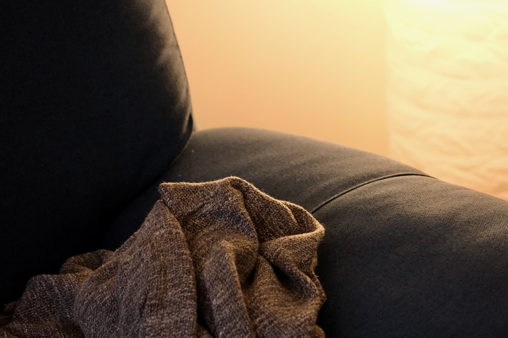

The undulation formed on the hand rest of my couch over time was previously unnoticed. The light sheering off this unevenness created something so unique to my home that I’d always be familiar with it, even if subconsciously.

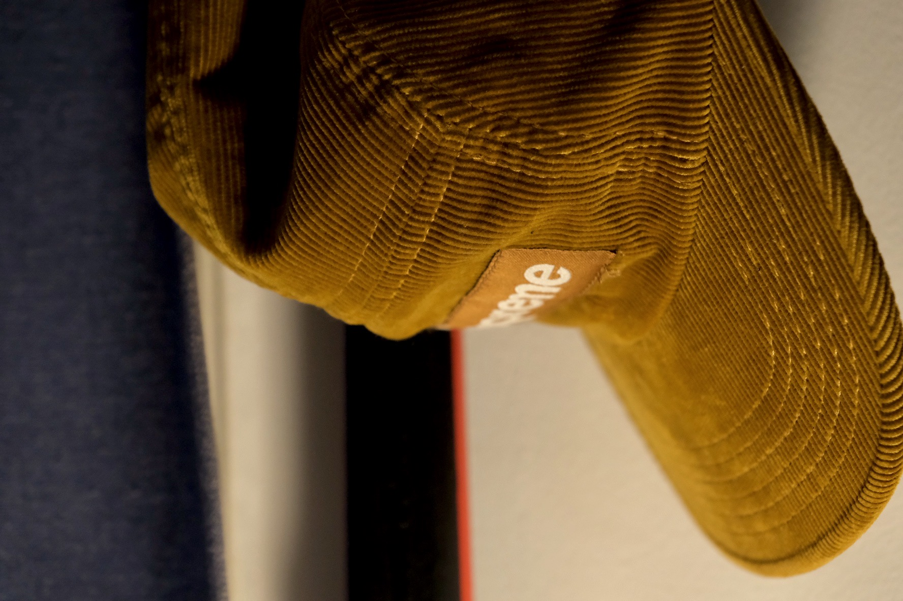

I absolutely love how light plays with corduroy. The unique color of this corduroy cap makes this scene a favorite of mine around home. I often find myself blankly staring into the cap’s texture when procrastinating.

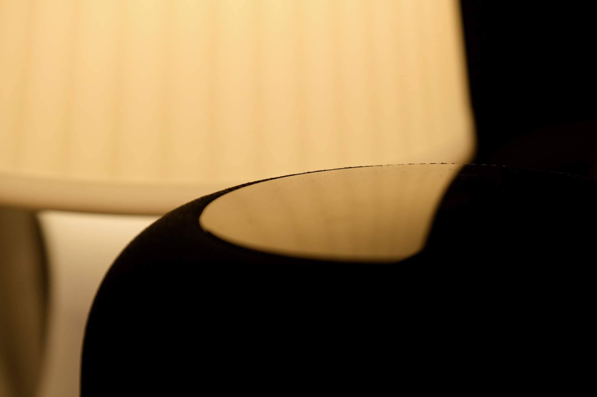

The light sources at home are deliberately indirect and soft to give a beautiful glow. The reflections of these lights on smooth surfaces look stunning. This scene shows my speaker reflecting a table lamp.

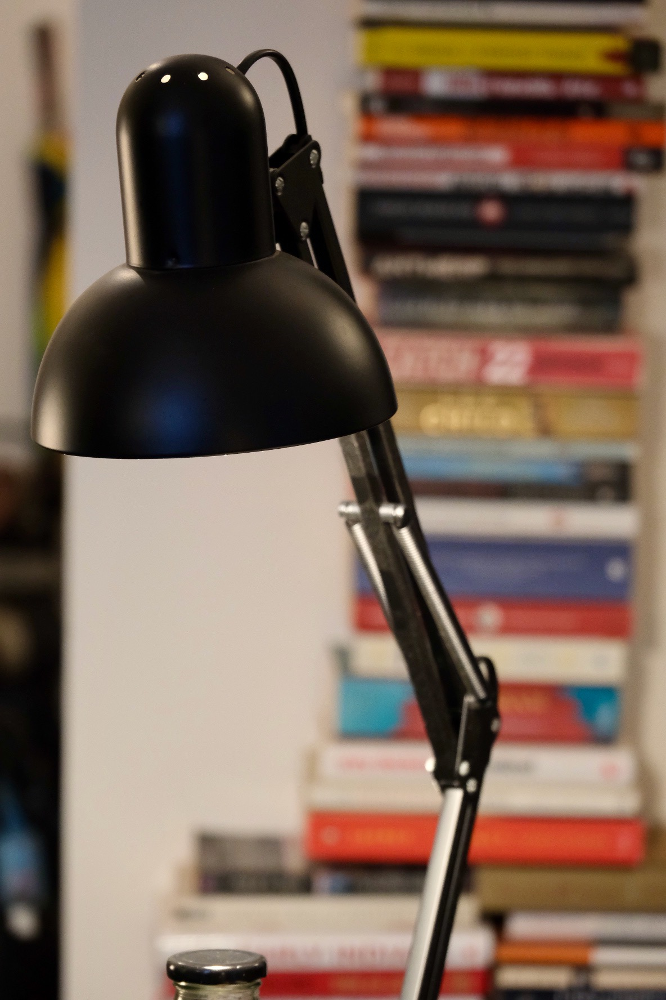

The swing-arm lamp pictured here has become an indispensable part of every day life at home. It directs light on anything I’m working on without directly hitting my eyes. I use it when I’m reading, painting, soldering a circuit board, unwrapping a package, or just clipping my nails. When I’m doing nothing I just fold it away so it illuminates the carpet and fills up the room with a mild glow from beneath.

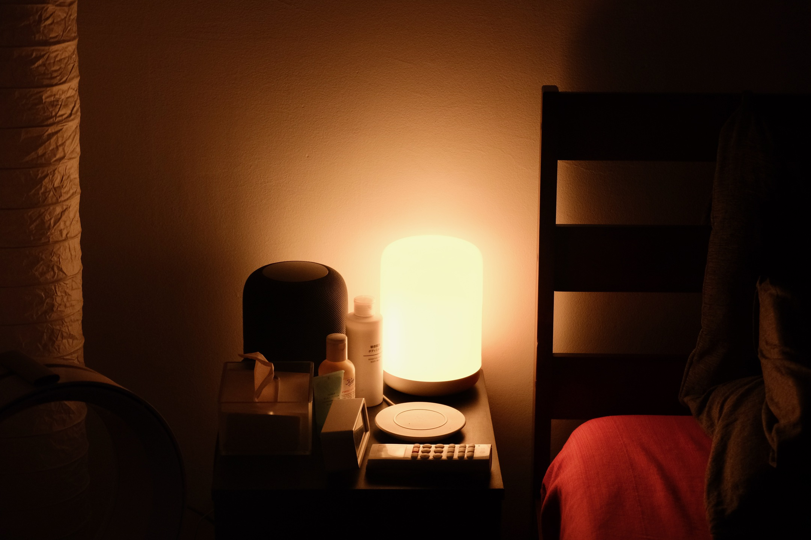

Having the right mood set in the bedroom is essential. I love to keep it warm and dull to help me fall asleep with the least number of distractions. There are only soft lights in the bedroom that change color to a deeper tone of warmth closer to bedtime.
I keep my bedside table full but uncluttered with everything I’d need throughout the night. The last thing one wants is to get off the bed to get something. I am so used to how things are placed that I can reach to whatever I need even when it’s completely dark. The details matter a great deal.  

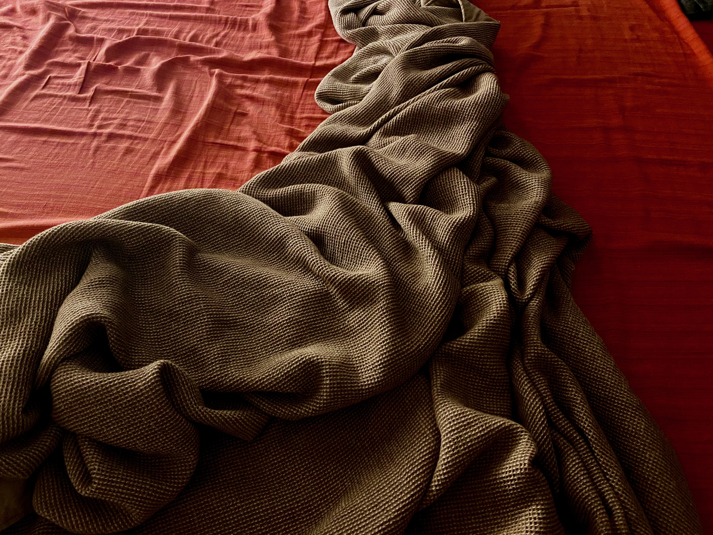

The pits that form this blanket’s texture create a complex and discrete contour of shadows. This reminds me of how cartographers use a grid of lines to show terrain and elevation on a planet’s surface.

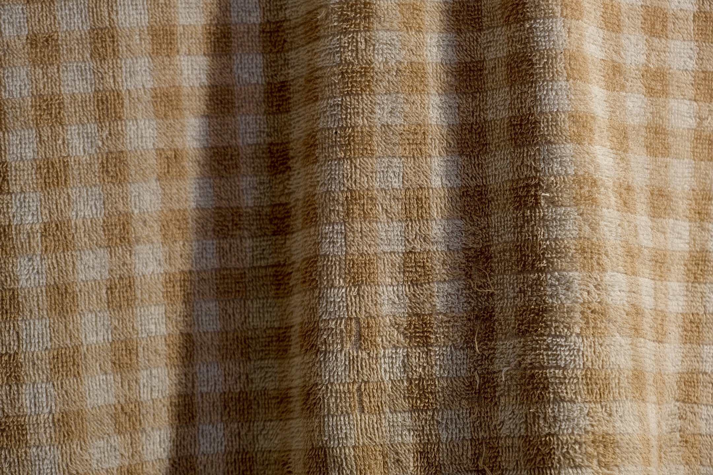

A good towel can make a significant difference in everyday life. On top of being highly absorbent, fast-drying, and soft on the skin, I find its texture pleasant to blindly stare at while in the shower. The disobeying strands of thread that stick out among the conforming rest invoke a want in me, like a lot of other people, to stand out.

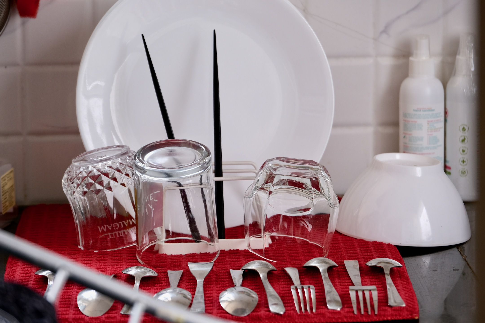

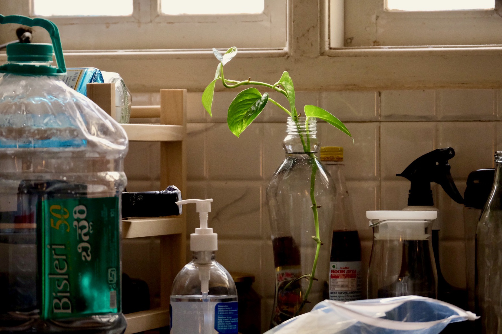

There’s nothing like the scene of used vessels in the sink or a clutter in the kitchen to remind oneself of the routines of life.
Personally, the chores around home, especially in the kitchen, prevent me from giving into laziness in the weekends. Routines can be good; they help one be grounded and poised.
Most mornings, when everything is in its right place in the kitchen, I stare out the window peacefully, partly lost in my reveries, while the faint smell of eggs being cooked wafts through the air. I love to start my days this way. It sets a familiar context to the rest of the day.

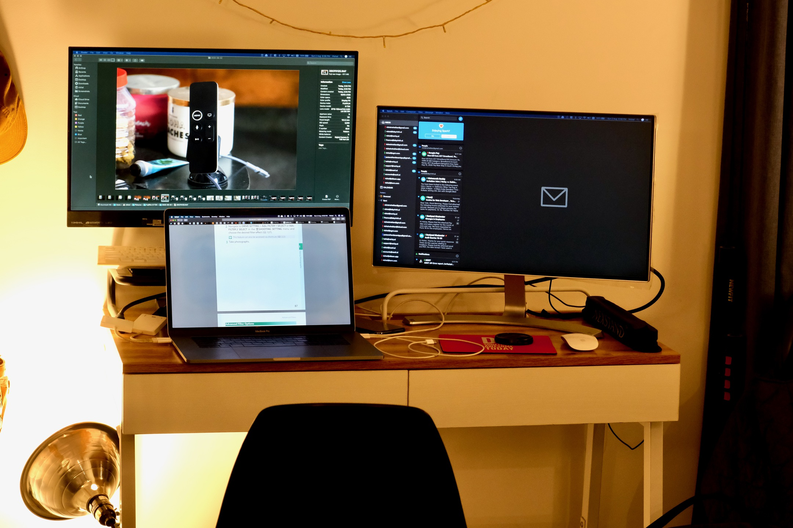

I spend a large part of my days on this desk. If I’m not working on my day’s tasks, I’m probably working on a personal project, learning something, or catching up on all the blogs and newsletters I follow. My desk is probably the most dynamic part of my home. I keep changing its configuration based on what I’m working on.
I have a bunch of clamp lights and flexible desk lights that I set up as needed. The most important thing for me is to have the wall behind my monitors be illuminated about as bright as the monitors. This strains the eyes lesser.

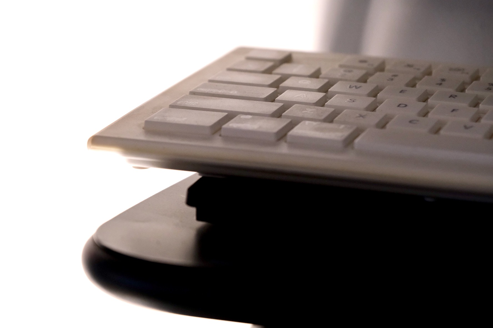

As you can see from the keyboard and other things around my home, I have a fondness for well-worn things. Being worn, to me, shows how important that particular thing was to me. It invokes a brief sense of nostalgia.

The details matter. The grains on a wooden tabletop, the unevenness of the wall plastering, the carpet fibers swept in different directions when walked upon, the dirt collected on switches, the markings of furniture on the wall, the ceramic cup being chipped-off a little, the sunlight coming in through the windows, the shadows, the faint scent unique to your home, and so much more. I believe that it’s these things that make your house a home — something that’s uniquely familiar to you.

